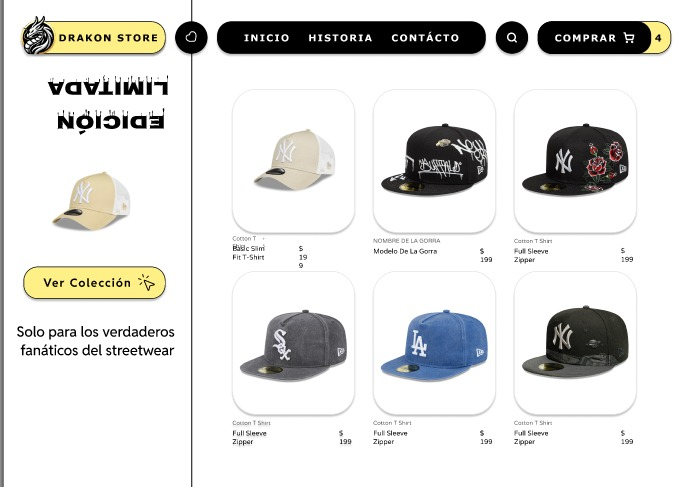
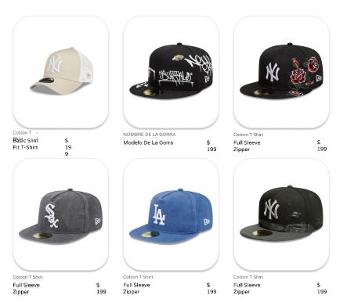
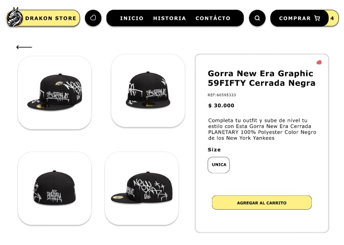
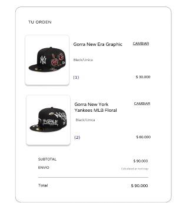
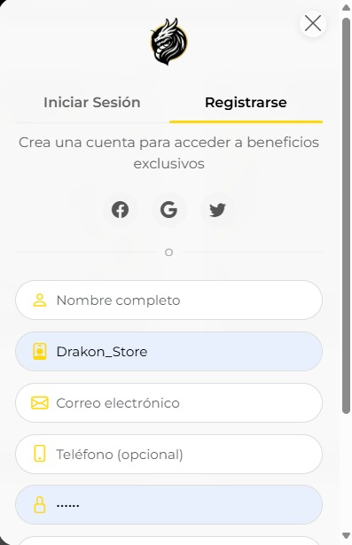
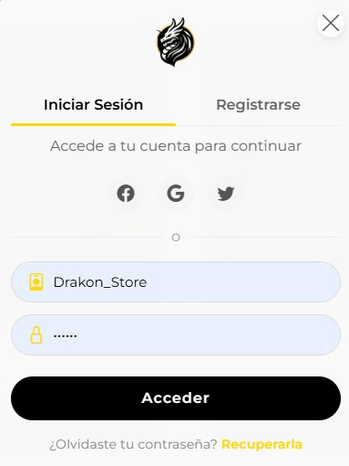
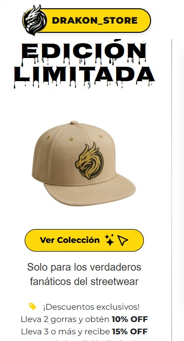

# Tarea 3: Desarrollar prototipos

**Proyecto:** Drakon Store  
**Versión:** 1.0  
**Fecha:** 5 de junio de 2025

## 1. Objetivos

- Obtener requisitos relativos a la interfaz de usuario.
- Detectar posibles conflictos en los requisitos.
- Profundizar en el conocimiento de los requisitos.

## 2. Descripción

En esta tarea se desarrollaron prototipos desechables del sistema Drakon Store, con el fin de que clientes, usuarios y desarrolladores pudieran visualizar y validar la futura interfaz. El prototipo permitió identificar nuevos requisitos, aclarar dudas y detectar conflictos que no habían surgido en etapas anteriores.  
El prototipo no será la base del desarrollo final, sino una herramienta de validación y comunicación.

## 3. Productos entregables
### Prototipos de Interfaz de Usuario
A continuación se presentan las imágenes del prototipo de la interfaz de usuario:

  

  <em>Prototipo 1: Pantalla de inicio</em>

  

  <em>Prototipo 2: Catálogo de productos</em>

  

  <em>Prototipo 3: Detalle de producto</em>

  

  <em>Prototipo 4: Carrito de compras</em>

  

  <em>Prototipo 5: Registro de usuario</em>

  

  <em>Prototipo 6: Inicio de sesión</em>

  

  <em>Prototipo 7: Perfil de usuario</em>

  > **Ubicación:**  
  > `Documentos/Docs de Tareas Asignadas/Imagenes/Fase_3_Prototipos/`

- **Aspectos de interfaz de usuario del modelo de comportamiento:**  
  Se relacionan los prototipos con los escenarios y flujos del modelo de comportamiento (DAS), permitiendo validar la experiencia de usuario y la coherencia con los requisitos funcionales.

- **Conflictos detectados:**  
  Durante la validación de los prototipos se identificaron los siguientes conflictos:
  - Preferencias distintas sobre la visualización del stock (resuelto mediante consenso).
  - Solicitud de filtros adicionales en el catálogo (pendiente de priorización).
  - Dudas sobre la integración de métodos de pago (se documentan para la siguiente iteración).

## 4. Técnicas aplicadas

- **Prototipado de sistemas software:**  
  Se utilizó la técnica de prototipado desechable (ver sección 4.6 de la metodología), generando pantallas clave del sistema para su revisión y validación con usuarios y clientes.
